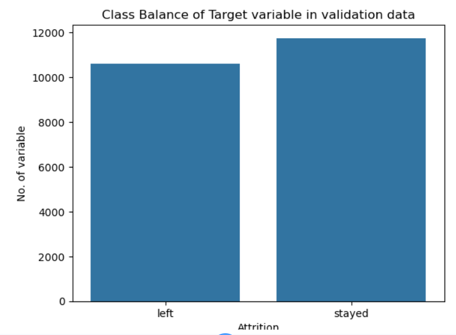
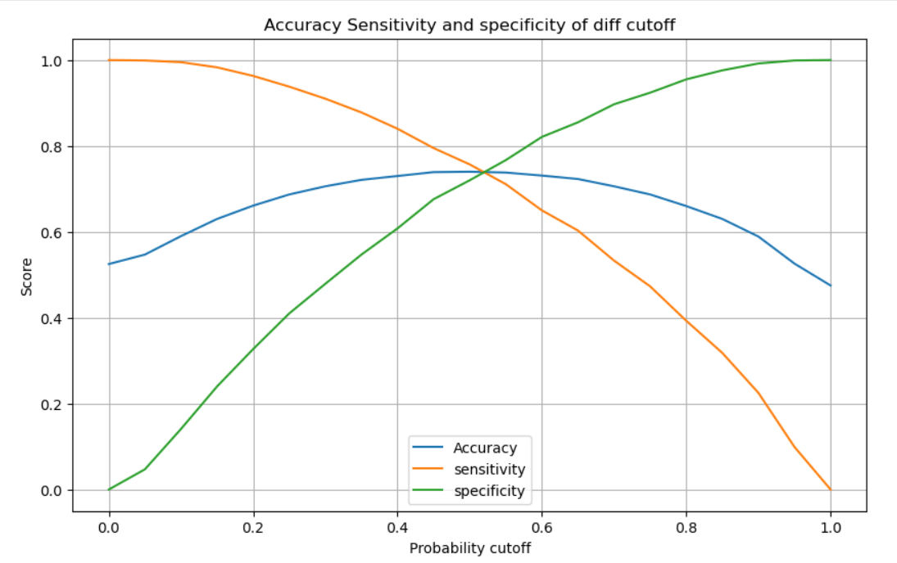
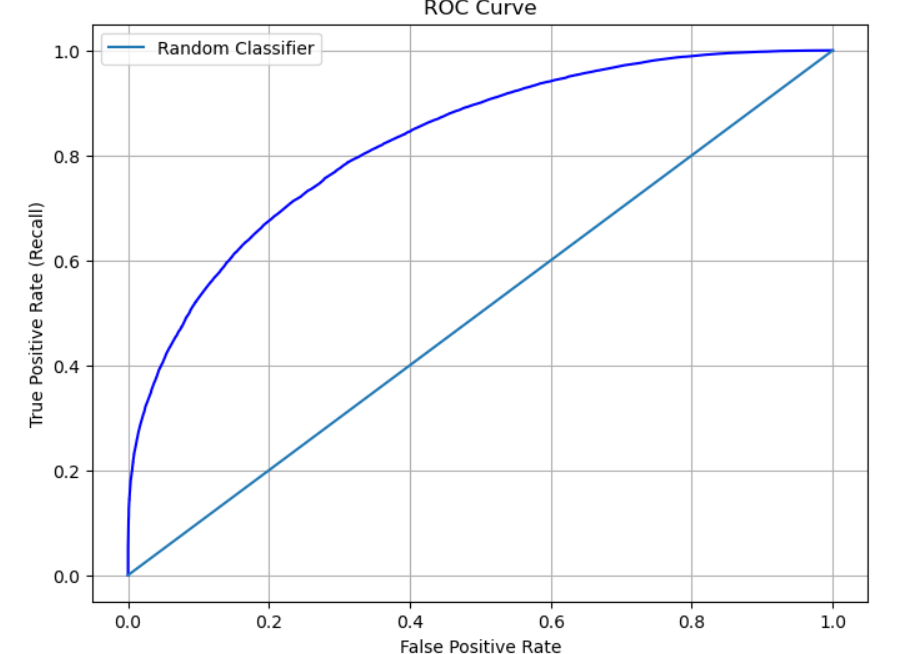

# 👩‍💼 Employee Retention Prediction

## 📌 Project Summary

Built a logistic regression model to predict employee retention using demographic, performance, and satisfaction data. Applied feature selection (RFE) and evaluated using accuracy and ROC-AUC to identify key drivers like job satisfaction and work-life balance.

---

## 🎯 Business Objective

To identify employees likely to stay and understand factors influencing retention, enabling proactive HR strategies and improved workforce stability.

---

## 🛠️ Methodology

* Data understanding and cleaning
* Exploratory Data Analysis (EDA)
* Train-validation split (70/30)
* Feature engineering
* Logistic regression model
* Model evaluation (accuracy, precision, recall, ROC-AUC)

## 📊 Model Evaluation

### 📊 Class Distribution

The dataset is relatively balanced, ensuring reliable model performance without bias.

---

### ⚖️ Threshold Analysis

Optimal cutoff (~0.5) balances sensitivity and specificity for better prediction.

---

### 📉 ROC Curve

The model performs significantly better than random, showing strong predictive ability.

---

## 🔑 Key Findings

* High job satisfaction → lower attrition
* Work-life balance strongly impacts retention
* Overtime increases the risk of leaving
* Model performs well (ROC curve above baseline)
